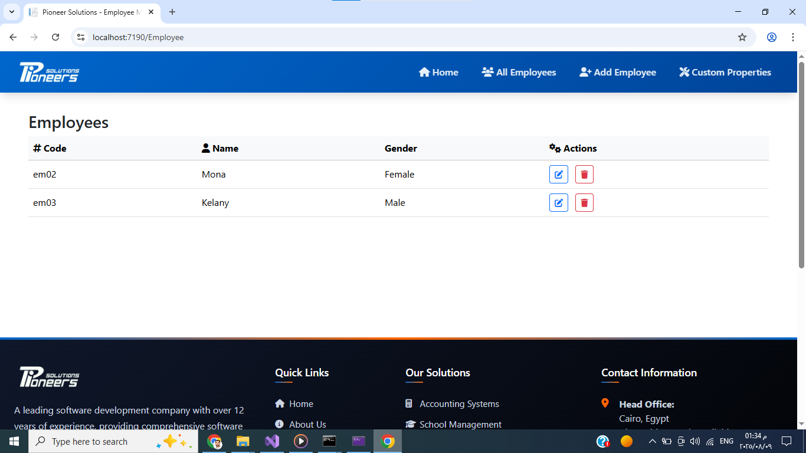

# Pioneer Solutions - Employee Management System
## [Video Link](https://drive.google.com/file/d/1q-LH0joPDhhEvz9K_snEk6NXsB9Jv6Kl/view?usp=sharing)

## Home Page

## Employees

## Add Employee

## Custom Property

## Add Property


A modern, responsive employee management system built with ASP.NET Core and Bootstrap 5, featuring a clean and intuitive user interface designed for efficient workforce management.

## 🚀 Features


### Employee Management
- **Add New Employees** - Streamlined employee onboarding process
- **Employee list** - Complete listing of all employees
- **Custom Properties** - Flexible employee data customization

### Technical Features
- **Bootstrap 5.3.0** - Modern CSS framework for responsive design
- **Font Awesome 6.4.0** - Comprehensive icon library
- **ASP.NET Core MVC** - Robust server-side framework
- **Responsive Design** - Mobile-friendly hamburger menu
- **Active State Management** - Dynamic navigation highlighting

## 🛠️ Installation

### Prerequisites
- .NET 6.0 or higher
- Visual Studio 2022 or VS Code
- SQL Server (LocalDB or Full)

### Setup Steps

1. **Clone the Repository**
   ```bash
   git clone https://github.com/your-username/pioneer-solutions.git
   cd pioneer-solutions
   ```

2. **Restore Dependencies**
   ```bash
   dotnet restore
   ```

3. **Update Database Connection**
   ```json
   // appsettings.json
   {
     "ConnectionStrings": {
       "DefaultConnection": "Server=(localdb)\\mssqllocaldb;Database=PioneerSolutions;Trusted_Connection=true"
     }
   }
   ```

4. **Run Database Migrations**
   ```bash
   dotnet ef database update
   ```

5. **Launch Application**
   ```bash
   dotnet run
   ```

6. **Access Application**
   Open your browser and navigate to `https://localhost:5001`

## 📁 Project Structure

```
PioneerSolutions/
├── Controllers/
│   ├── HomeController.cs
│   ├── EmployeeController.cs
│   └── CustomPropertyController.cs
├── Models/
│   ├── Employee.cs
│   ├── CustomProperty.cs
│   └── ViewModels/
├── Views/
│   ├── Shared/
│   │   ├── _Layout.cshtml
│   │   └── _NavBar.cshtml
│   ├── Home/
│   └── Employee/
├── wwwroot/
│   ├── css/
│   ├── js/
│   └── Images/
│       └── Pioneerlogo.png
├── Data/
│   └── ApplicationDbContext.cs
└── README.md
```

